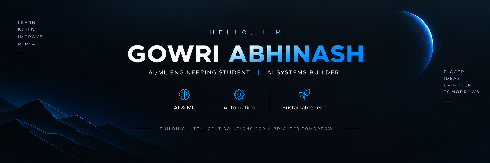

 

## 👋 About Me

I’m an AI/ML engineering student who enjoys turning ideas into
<strong>working software systems</strong>.

I build projects around <strong>AI, machine learning, intelligent automation,
and full-stack applications</strong> — learning by experimenting,
building, breaking, and improving.

 

<strong>AI & ML</strong>
&nbsp; • &nbsp;
<strong>Intelligent Systems</strong>
&nbsp; • &nbsp;
<strong>Automation</strong>
&nbsp; • &nbsp;
<strong>Software Engineering</strong>

---

## 🚀 Featured Work

<table>
<tr>

<td width="50%" valign="top">

### 🤖 JARVIS-Ai

**Adaptive Personal Desktop AI Assistant**

AI assistant exploring memory, voice interaction, context awareness,
desktop automation, and proactive assistance.

`Python` · `AI` · `Automation` · `Voice`

 

<a href="https://github.com/i-am-abhinash/JARVIS-Ai">
View Repository →
</a>

</td>

<td width="50%" valign="top">

### 🎓 AcaDesk-Student-Risk-Prediction-System

**Student Risk Prediction System**

Machine-learning application focused on academic analytics,
student risk prediction, and early intervention.

`Python` · `Machine Learning` · `Scikit-learn` · `MySQL`

 

<a href="https://github.com/i-am-abhinash/AcaDesk-Student-Risk-Prediction-System">
View Repository →
</a>

</td>

</tr>

<tr>

<td width="50%" valign="top">

### 📰 Smart-news-Digest

**AI-Powered News Intelligence Platform**

Full-stack application for news retrieval, NLP summarization,
categorization, and text-to-audio delivery.

`React` · `TypeScript` · `FastAPI` · `NLP`

 

<a href="https://github.com/i-am-abhinash/Smart-news-Digest">
View Repository →
</a>

</td>

<td width="50%" valign="top">

### 🧠 ContextAI_V3

**Context-Aware AI System**

An exploration of intelligent interaction through contextual
information and AI-driven processing.

`Python` · `AI` · `Intelligent Systems`

 

<a href="https://github.com/i-am-abhinash/ContextAI_V3">
View Repository →
</a>

</td>

</tr>

<tr>

<td width="50%" valign="top">

### 🧪 GramAI

**AI Application**

An AI-focused project exploring practical intelligent application
development and content processing.

`Python` · `AI` · `NLP`

 

<a href="https://github.com/i-am-abhinash/GramAI">
View Repository →
</a>

</td>

<td width="50%" valign="top">

### 🌱 EcoLeauge

**Environmental Technology Project**

A technology-focused project exploring software solutions
for environmental and sustainability challenges.

`JavaScript` · `Sustainability` · `Technology`

 

<a href="https://github.com/i-am-abhinash/EcoLeauge">
View Repository →
</a>

</td>

</tr>
</table>

---

## 🛠️ Technology

 

**AI / ML** · **Generative AI** · **NLP** · **Automation** ·
**Full-Stack Development** · **Software Engineering**

---

## 🧠 Current Focus

**AI / ML**
&nbsp; → &nbsp;
**Generative AI**
&nbsp; → &nbsp;
**AI Agents**
&nbsp; → &nbsp;
**Intelligent Systems**
&nbsp; → &nbsp;
**Automation**
&nbsp; → &nbsp;
**Full-Stack AI**

 

I’m focused on turning AI capabilities into
<strong>complete, usable software systems</strong>
rather than isolated experiments.

---

## 💡 How I Build

### Learn → Build → Break → Improve → Repeat

 

I learn primarily by building projects, experimenting with ideas,
solving problems, and improving systems through iteration.

---

## 📌 Explore My Work

 

  

  

### Building intelligent systems, one project at a time. 🚀

